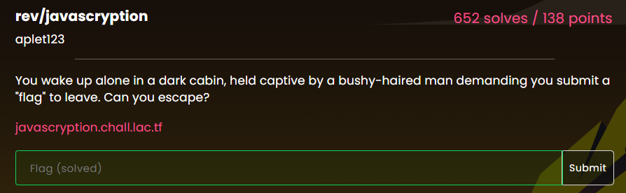
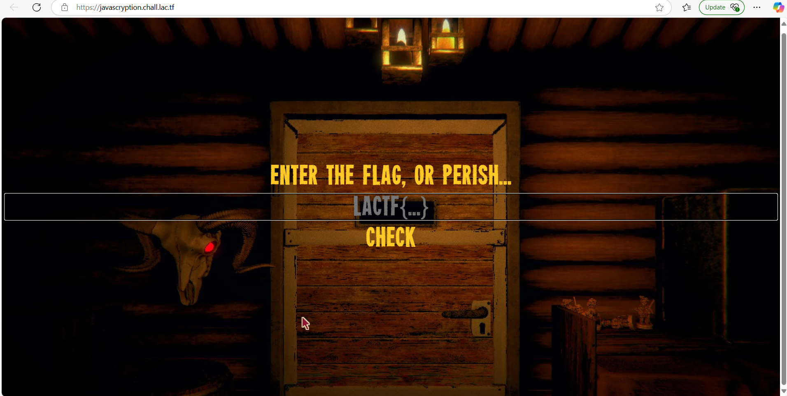
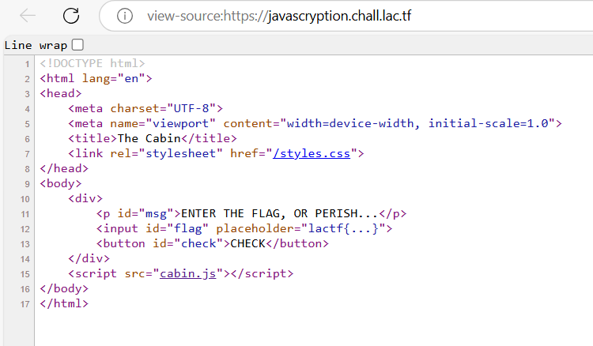
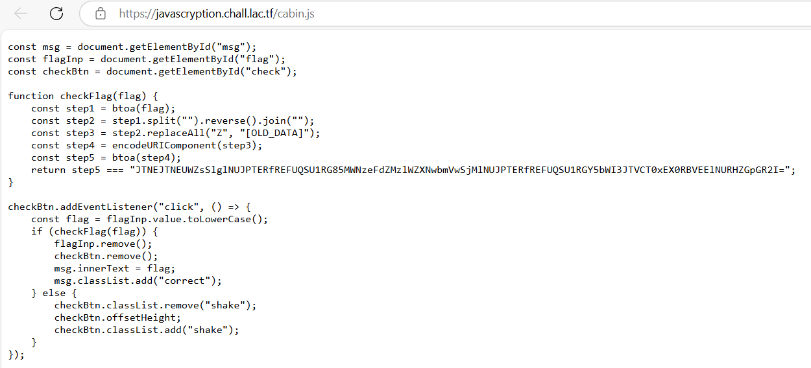
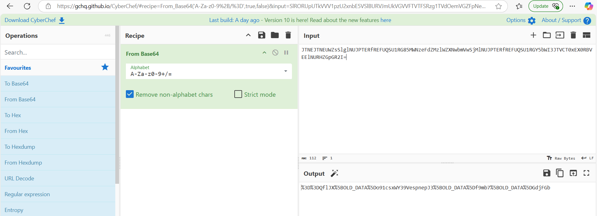
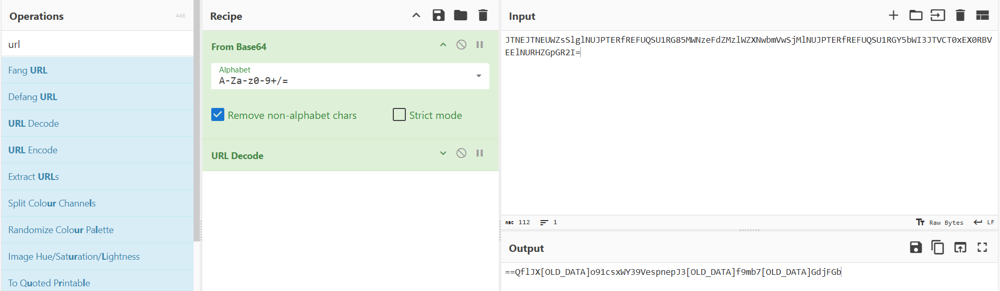
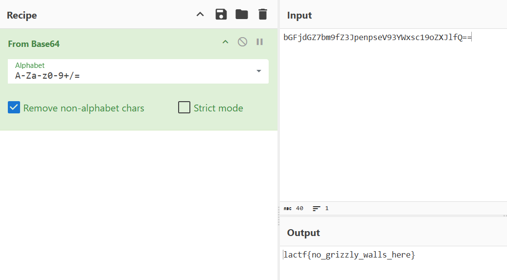

# rev/javascryption




## Strategy
1. Visit the web page [javascryption.chall.lac.tf](https://javascryption.chall.lac.tf/). At first glance, it might seem like there’s nothing of value on the page.



2. Check the [source code](https://github.com/uclaacm/lactf-archive/blob/main/2025/rev/javascryption/src/index.html). In the source, you'll notice there’s a "hidden" script.



3. Inspect the JavaScript file [cabin.js](https://github.com/uclaacm/lactf-archive/blob/main/2025/rev/javascryption/src/cabin.js). In this file, you'll find clear instructions outlining five steps to find the flag.




## Methology
To get the flag, we shall go through the processes in reverse.
1. A string that started with "JTNEJTNEUWZsSlglNUJPTERfREFUQSU1RG85MWNzeFdZMzlWZXNwbmVwSjMlNUJPTERfREFUQSU1RGY5bWI3JTVCT0xEX0RBVEElNURHZGpGR2I=" concluded with the letters "=". Usually, a Base64 form string is used. Additionally, based on step 4, the JavaScript method btoa() is employed to convert a binary string into a Base64-encoded ASCII string. By using CyberChef, we can perform the same conversion to obtain:"%3D%3DQflJX%5BOLD_DATA%5Do91csxWY39VespnepJ3%5BOLD_DATA%5Df9mb7%5BOLD_DATA%5DGdjFGb"



2. In step 4, the encodeURIComponent method in JavaScript is used to encode a URI component. To reverse this process, you can use the decodeURIComponent method. To achieve the same result using CyberChef, select the 'URL Decode' operation and then transfer the session to the Recipe area for further manipulation. You'll now get "==QflJX[OLD_DATA]o91csxWY39VespnepJ3[OLD_DATA]f9mb7[OLD_DATA]GdjFGb"



3. Step 3 will replace all "Z" in "[OLD_DATA]". We can easily erase "[OLD_DATA]" by hand. The current value is "==QflJXZo91csxWY39VespnepJ3Zf9mb7ZGdjFGb"

4. In the second step, the strings will be merged in reversed order. To accomplish this, you can either use an online reverse tool or create a simple Python script to reverse the strings and merge them accordingly. We're now receiving "bGFjdGZ7bm9fZ3JpenpseV93YWxsc19oZXJlfQ=="

```python
def reverse_string(s):
    reversed_s = ''
    for char in s:
        reversed_s = char + reversed_s
    return reversed_s

original_string = "==QflJXZo91csxWY39VespnepJ3Zf9mb7ZGdjFGb"
reversed_string = reverse_string(original_string)
print(reversed_string)  # Output: bGFjdGZ7bm9fZ3JpenpseV93YWxsc19oZXJlfQ==
```

5. Finally, the btoa() method requires to decode the string with Base64.



Flag: lactf{no_grizzly_walls_here}