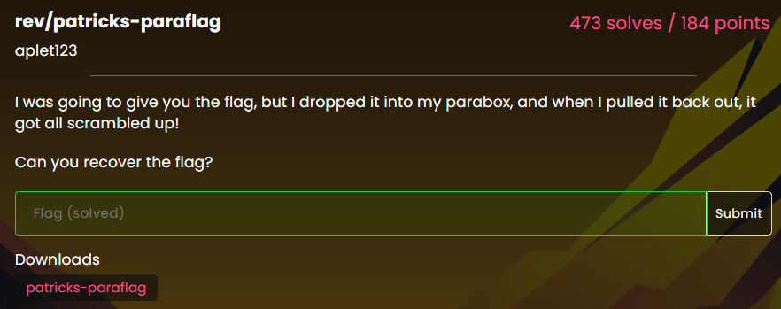
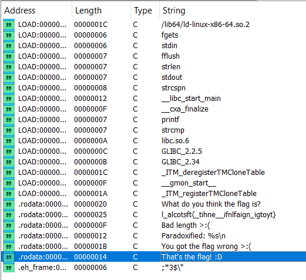
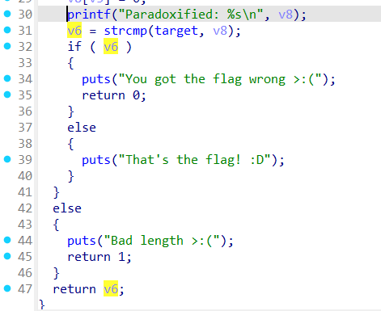
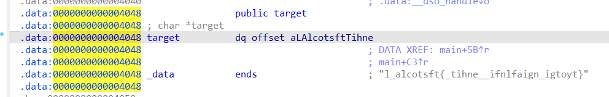
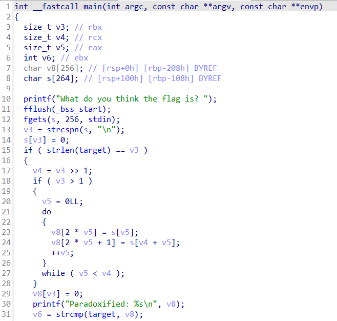
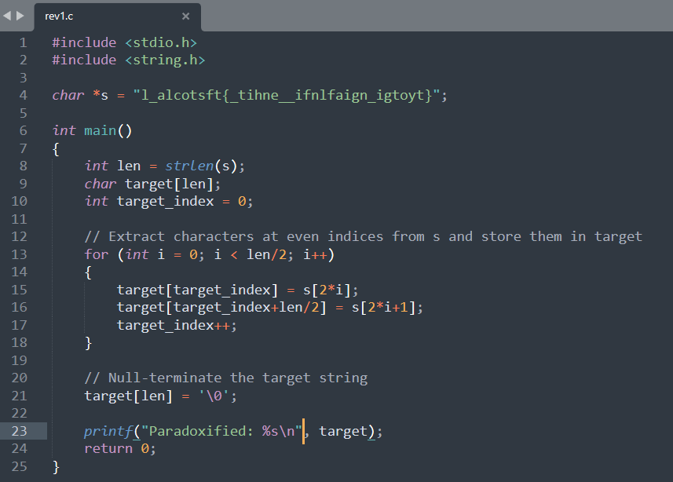
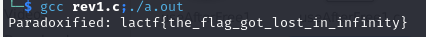

# rev/patricks-paraflag

## Methology
1. Download the file [patricks-paraflag](https://github.com/uclaacm/lactf-archive/blob/main/2025/rev/patricks-paraflag/patricks-paraflag). And open the binary in IDA Pro. Find out that string "That's the flag! :D" looks like relavent.

2. Navigate the string to the pseudocode. It indicates that two strings should be identical so that we can find the flag.

3. The goal is to figure out how to match the string "target". In IDA Pro, the string "target" is localized in data section, "l_alcotsft{_tihne_\_ifnlfaign_igtoyt}". So it might be a global variable, which looks like the flag.

4. Based on the code line 15, the input should initially match the flag's length. Then, v5 appears like a "i" in for loop: it starts with 0LL, increments by 1 for each loop and is less than v4. v4 is the right shift 1 of v3, which equals v3 divided by 2. This indicates that there is a loop goes over the half of the flag character by character.

- target represents flag :triangular_flag_on_post:
- v8 = flag
- v4 = strlen(flag) >> 1 = strlen(flag) / 2

- s[v5] (s[i]) represents first half of input;
- s[v4+v5] (s[i] + len/2) represents the remaning half of input;
- v8[2*v5] = flag[2*i] represents the even position characters in flag, such as flag[0], flag[2], flag[4],... while i = 0, 1, 2,...;
- v8[2*v5+1] = flag[2*i+1] represents the odd position characters in flag, such as flag[1], flag[3], flag[5],..., while i = 0, 1, 2,...;

More clearly, generating a c++ [code](rev1.c) looks like below:

Run the code and get the flag:

Flag: lactf{the_flag_got_lost_in_infinity}