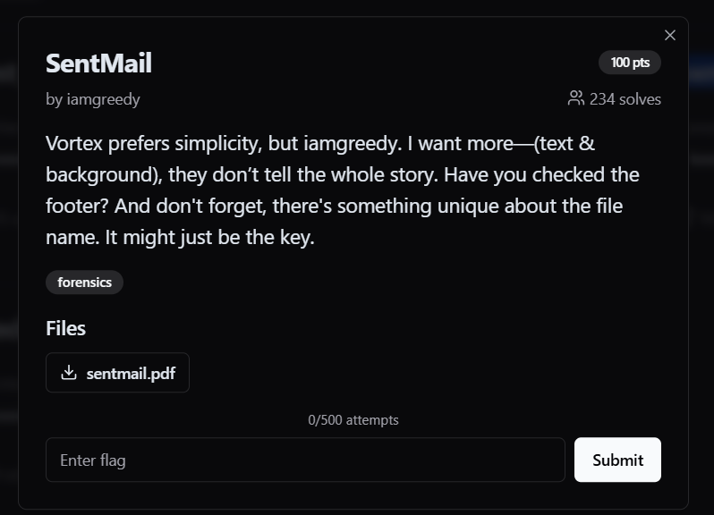
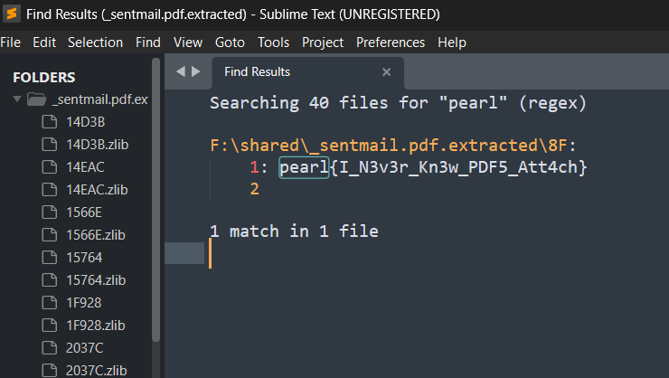
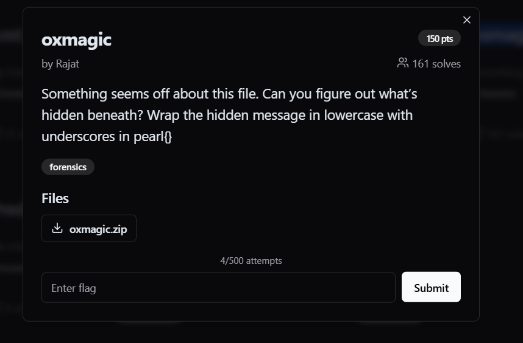
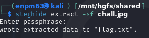
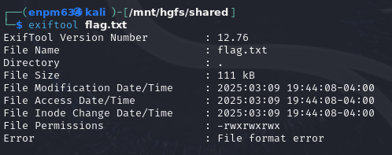
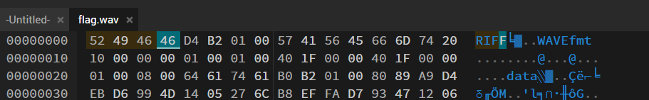
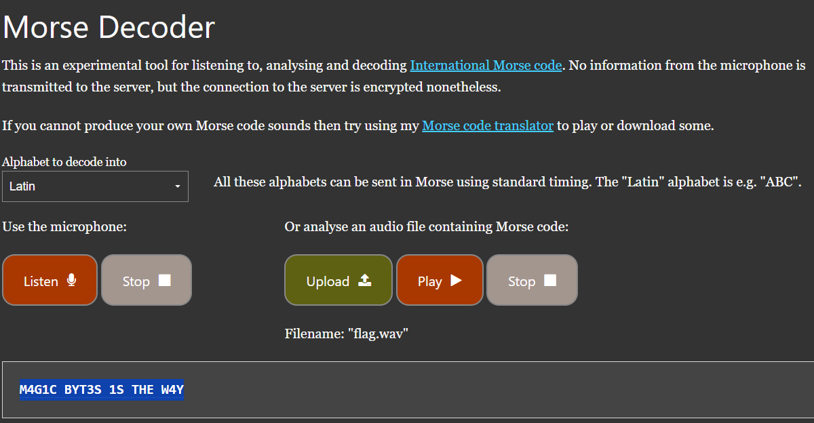
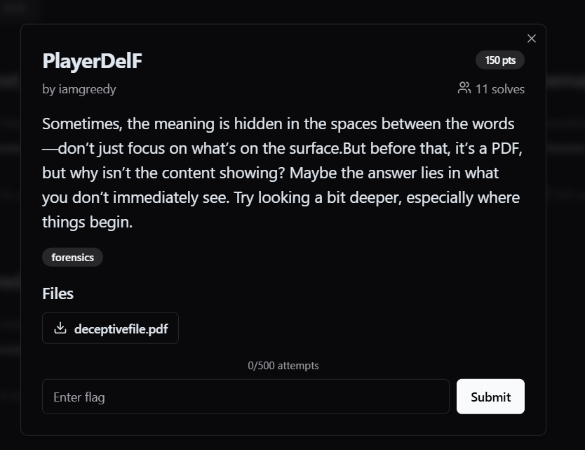

# PearlCTF 2025 [https://pearlctf.in/](https://pearlctf.in/)

## forensics

### SentMail

1. morse code, get a outdated youtube link :x:
2. background & text give a hint, open pdf, ctrl + A, get a message from "space", also points to the same video link :x:
3. exiftool file, nothing here :x:
4. binwalk -e file, able to find a flag pearl{I_N3v3r_Kn3w_PDF5_Att4ch} :o:

### oxmagic

1. stego image, nothing :x:
2. steghide extract -sf chall.jpg, got a flag.txt

3. format of the file has error

4. check the header, is wave
5. change in [hex](https://hexed.it/)

6. [decode](https://morsecode.world/international/decoder/audio-decoder-adaptive.html) audio of morse

7. all lowercase with underscore, get pearl{m4g1c_byt3s_1s_the_w4y} :o:

### PlayerDelF

