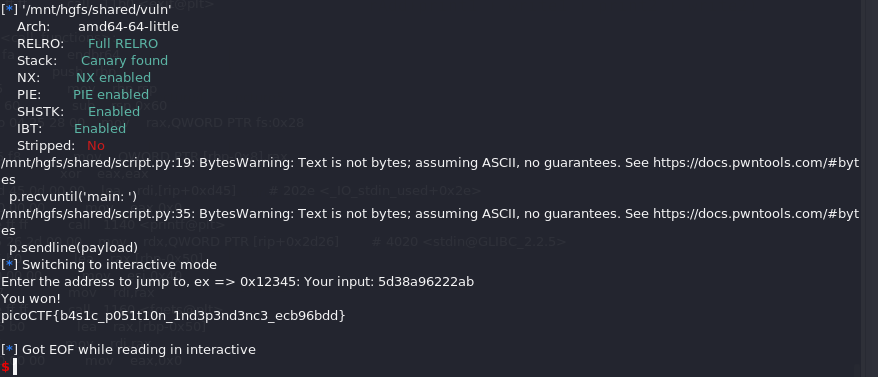

# pwn/PIE TIME

[picoCTF 2025](https://play.picoctf.org/practice?originalEvent=74&page=1)

## Methology
1. Enabled PIE and NX.
2. script needs to calculate the offset.
3. the position of main and win(target) functions is relative.
4. elf.sys is able to find static symbol address in running time. e.g. elf.sym['main']
5. in main function, %p format is able to leak main function address.
6. all conditions are set.
7. run [script.py](script.py)

Flag: picoCTF{b4s1c_p051t10n_1nd3p3nd3nc3_ecb96bdd}