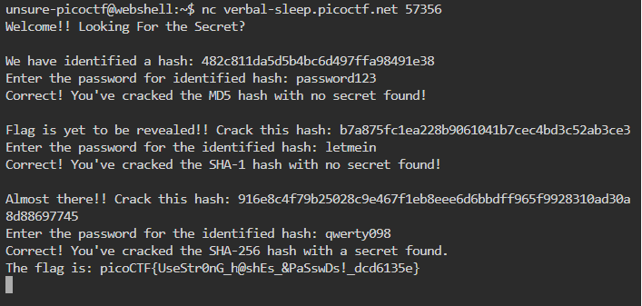

# crypt/EVEN RSA CAN BE BROKEN???

[picoCTF 2025](https://play.picoctf.org/practice?originalEvent=74&page=1)

## Methology
1. OSINT is faster
2. [Hash identify](https://hashes.com/en/tools/hash_identifier) three hashes are MD5, SHA1, and SHA256 respectively.
3. [Decypt Hash](https://10015.io/tools/md5-encrypt-decrypt) each hashes.

Flag: picoCTF{UseStr0nG_h@shEs_&PaSswDs!_dcd6135e}