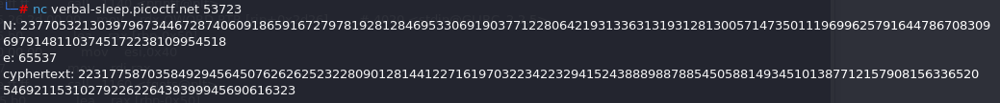
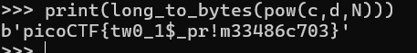

# crypt/EVEN RSA CAN BE BROKEN???

[picoCTF 2025](https://play.picoctf.org/practice?originalEvent=74&page=1)




## Methology
1. N is not a prime
2. Euler's totient is 11885266065198983672336437030459329583639890964064234766534595188561403210965668156596564065028573675055984981289582239335415484895740551872586119054977258

```
python
from Crypto.Util.number import inverse, long_to_bytes

N = 23770532130397967344672874060918659167279781928128469533069190377122806421931336313193128130057147350111969962579164478670830969791481103745172238109954518
e = 65537
c = 22317758703584929456450762626252322809012814412271619703223422329415243888988788545058814934510138771215790815633652054692115310279226226439399945690616323
phi = 11885266065198983672336437030459329583639890964064234766534595188561403210965668156596564065028573675055984981289582239335415484895740551872586119054977258
d = pow(e, -1, phi)
print(long_to_bytes(pow(c,d,N)))
```

Flag: picoCTF{tw0_1$_pr!m33486c703}